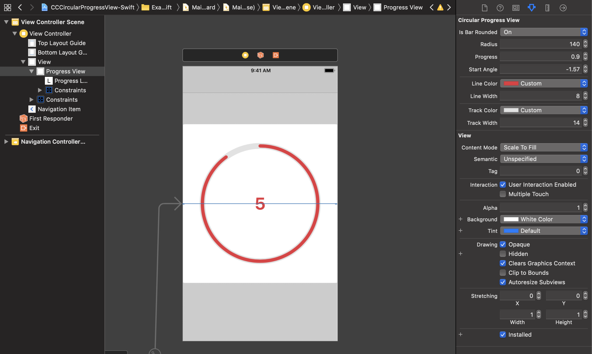

# CCCircularProgressView-Swift
Circular progress view written in Swift because these controls always come in handy.

[](https://travis-ci.org/hsuanchih/CCCircularProgressView-Swift)
[](https://cocoapods.org/pods/CCCircularProgressView-Swift)
[](https://cocoapods.org/pods/CCCircularProgressView-Swift)
[](https://cocoapods.org/pods/CCCircularProgressView-Swift)

## Demo


## Usage
### Adding Circular Progress View
* Add CCGCircularProgressView instance to your view (OR, in Interface Builder, set an UIView's Custom Class to CCGCircularProgressView).

### Customisations
#### Customisable Properties:
* roundedCorner
* radius
* startAngle
* lineColor
* lineWidth
* trackColor
* trackWidth

#### Customise using Attributes Inspector in Interface Builder


#### Customise Programmatically
```Swift
class ViewController: UIViewController {
    
    @IBOutlet weak var progressView : CCCircularProgressView! {
        didSet {
            progressView.isBarRounded = true
            progressView.radius = 140
            progressView.startAngle = -CGFloat.pi/2
            progressView.lineColor = .red
            progressView.lineWidth = 20
            progressView.trackColor = .lightGray
            progressView.trackWidth = 25
        }
    }
    .
    .
}
```

### Update Progress
```Swift
// Progress value is between 0 and 1
progressView.progress = 0.5
```

## Example

To run the example project, clone the repo, and run `pod install` from the Example directory first.

## Requirements

## Installation

CCCircularProgressView-Swift is available through [CocoaPods](https://cocoapods.org). To install
it, simply add the following line to your Podfile:

```ruby
pod 'CCCircularProgressView-Swift'
```

## Author

Hsuan-Chih Chuang, hsuanchih.chuang@gmail.com

## License

CCCircularProgressView-Swift is available under the MIT license. See the LICENSE file for more info.
